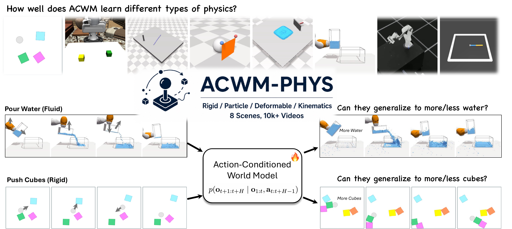

# ACWM-Phys

**ACWM-Phys: Investigating Generalized Physical Interaction in Action-Conditioned Video World Models**

[Project Page](https://xavihart.github.io/ACWM-Phys) · [arXiv](#) · [Dataset](https://huggingface.co/datasets/t1an/ACWM-Phys) · [Checkpoints](https://huggingface.co/t1an/ACWM-Phys-checkpoints)

> *Haotian Xue†, Yipu Chen\*, Liqian Ma\*, Zelin Zhao, Lama Moukheiber, Yuchen Zhu, Yongxin Chen*
> 
> Georgia Institute of Technology
> (†project lead, \*equal contribution)

---



## Overview

ACWM-Phys is a benchmark for evaluating action-conditioned video world models under diverse physical dynamics. It spans **8 environments** across 4 physics regimes:

| Category | Environments |
|---|---|
| Rigid-Body | Push Cube, Stack Cube |
| Deformable | Push Rope, Cloth Move |
| Particle | Push Sand, Pour Water |
| Kinematics | Robot Arm, Reacher |

Each environment provides 1,000 training trajectories + controlled in-distribution (InD) and out-of-distribution (OoD) test splits. We also provide **ACWM-DiT**, a latent diffusion transformer baseline trained with flow matching.

---

## Installation

We use [uv](https://github.com/astral-sh/uv) for fast, reproducible environment management.

```bash
git clone https://github.com/xavihart/ACWM-Phys.git
cd ACWM-Phys

# Create and activate a virtual environment
uv venv --python 3.10
source .venv/bin/activate

# Install dependencies
uv pip install -r requirements.txt

# Flash Attention (recommended for speed)
uv pip install flash-attn --no-build-isolation
```

---

## Dataset

Download the ACWM-Phys dataset from HuggingFace:

```bash
huggingface-cli download t1an/ACWM-Phys --repo-type dataset --local-dir ./data
```

Then set the data root:

```bash
export ACWM_DATA_ROOT=./data
```

Expected structure:
```
data/
├── rigid_dynamics/
│   ├── push_block/      {ind_train, ind_test, ood_test}/
│   └── stack_cube/
├── deformable/
│   ├── push_rope/
│   └── clothmove/
├── particle/
│   ├── push_sand/
│   └── pour_water/
└── kinematics/
    ├── robot_arm_64/
    └── reacher/
```

### Dataset Format

Each split directory (e.g. `push_block/ind_train/`) contains:

- **`episode_{i}.mp4`** — RGB video at 10 fps, 240×240 (240×400 for Push Sand)
- **`metadata.pt`** — serialized list of episode dicts (load with `torch.load`)

Each entry in `metadata.pt` has:

| Field | Type | Description |
|---|---|---|
| `video_path` | `str` | Filename relative to the split dir, e.g. `episode_0.mp4` |
| `actions` | `FloatTensor [T, action_dim]` | Per-step action sequence |
| `length` | `int` | Number of frames T |
| `seed` | `int` | Random seed used during simulation |
| `episode_idx` | `int` | Global episode index (some environments) |

Example:
```python
import torch

metadata = torch.load("data/rigid_dynamics/push_block/ind_train/metadata.pt", weights_only=False)
entry = metadata[0]
# entry["video_path"]  → "episode_0.mp4"
# entry["actions"]     → Tensor of shape [T, 2]
# entry["length"]      → 16
```

---

## Checkpoints

Download the pretrained DiT-S checkpoints (100k steps) and the Wan 2.1 VAE:

```bash
huggingface-cli download t1an/ACWM-Phys-checkpoints --local-dir ./checkpoints
```

Set the VAE path:

```bash
export WAN_VAE_PATH=./checkpoints/Wan2.1_VAE.pth
```

The env configs in `configs/envs/` also reference `WAN_VAE_PATH` via the `vae_config` field.

### Released Checkpoints

All checkpoints are DiT-S (~200M parameters), trained for 100k steps with flow matching.

| Environment | Category | Action Dim | Resolution | Checkpoint |
|---|---|---|---|---|
| Push Cube | Rigid-Body | 2 | 240×240 | [link](https://huggingface.co/t1an/ACWM-Phys-checkpoints/blob/main/VideoDiT_S_push_cube_240x240/latest.pt) |
| Stack Cube | Rigid-Body | 7 | 240×240 | [link](https://huggingface.co/t1an/ACWM-Phys-checkpoints/blob/main/VideoDiT_S_stack_cube_240x240/latest.pt) |
| Push Rope | Deformable | 2 | 240×240 | [link](https://huggingface.co/t1an/ACWM-Phys-checkpoints/blob/main/VideoDiT_S_push_rope_240x240/latest.pt) |
| Cloth Move | Deformable | 3 | 240×240 | [link](https://huggingface.co/t1an/ACWM-Phys-checkpoints/blob/main/VideoDiT_S_clothmove_240x240_240x240/latest.pt) |
| Push Sand | Particle | 7 | 240×400 | [link](https://huggingface.co/t1an/ACWM-Phys-checkpoints/blob/main/VideoDiT_S_push_sand_240x400/latest.pt) |
| Pour Water | Particle | 4 | 240×240 | [link](https://huggingface.co/t1an/ACWM-Phys-checkpoints/blob/main/VideoDiT_S_pour_water_240x240/latest.pt) |
| Robot Arm | Kinematics | 7 | 240×240 | [link](https://huggingface.co/t1an/ACWM-Phys-checkpoints/blob/main/VideoDiT_S_robot_arm_240x240/latest.pt) |
| Reacher | Kinematics | 2 | 240×240 | [link](https://huggingface.co/t1an/ACWM-Phys-checkpoints/blob/main/VideoDiT_S_reacher_240x240/latest.pt) |

---

## Evaluation

Evaluate a single environment:

```bash
python eval.py --env push_cube --steps 50 --split both --save_videos
```

Evaluate all 8 environments:

```bash
bash scripts/eval_all.sh --save_videos
```

Results are written to `results/results.md`. Videos are saved under `results/{env}/steps_50/{split}/sample_{i}/video.mp4` as side-by-side GT (left) | Prediction (right).

**Key arguments:**

| Argument | Default | Description |
|---|---|---|
| `--env` | required | Environment name |
| `--steps` | 50 | Denoising steps |
| `--split` | both | `ind_test`, `ood_test`, or `both` |
| `--ckpt` | auto | Override checkpoint path |
| `--cfg` | auto | Override config path |
| `--save_videos` | off | Save GT\|Pred side-by-side videos |

---

## Training

Train DiT-S on Push Cube (single GPU):

```bash
python train.py --config configs/envs/push_cube.yaml
```

Multi-GPU (4 GPUs):

```bash
torchrun --nproc_per_node=4 train.py --config configs/envs/push_cube.yaml
```

SLURM example:

```bash
sbatch scripts/train_slurm.sh push_cube
```

Training hyperparameters are in `configs/envs/{env}.yaml`. Model size (S/M/L) is set via `model_type: dit_s` in the config.

---

## Model Architecture

ACWM-DiT takes the first video frame + full action sequence and predicts the complete future trajectory:

1. **Causal VAE (Wan 2.1)** — encodes video into 16-ch latent tokens at H/8×W/8, 4× temporal compression
2. **DiT with flow matching** — denoises the full latent trajectory; supports AdaLN and cross-attention action conditioning
3. **Action conditioning** — injected via AdaLN (default) or cross-attention (better for high-dim actions)

Three model sizes: DiT-S (~200M), DiT-M (~600M), DiT-L (~800M).

---

## Metrics

| Metric | Description |
|---|---|
| MSE | Mean squared error on pixel values in [0,1] |
| M-MSE | Motion-weighted MSE (floor 0.01; focuses on moving regions) |
| PSNR | Peak signal-to-noise ratio (dB) |
| SSIM | Structural similarity index |

---

## Citation
```
@article{xue2026acwm,
  title={ACWM-Phys: Investigating Generalized Physical Interaction in Action-Conditioned Video World Models},
  author={Xue, Haotian and Chen, Yipu and Ma, Liqian and Zhao, Zelin and Moukheiber, Lama and Zhu, Yuchen and Che, Yongxin},
  journal={arXiv preprint arXiv:2605.08567},
  year={2026}
}
```
